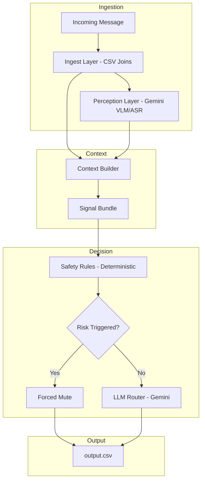

<div align="center">

# Message Notification Router

**An AI agent that knows when to interrupt you — and when not to.**


</div>

A multimodal notification routing system for WhatsApp-style messaging platforms.
Given an incoming message — text, image poster/screenshot, or voice note — it
decides whether to **notify** (interrupt now), **digest** (show later), or
**mute** (suppress), personalized per user and grounded in real behavioral
and relationship history, with deterministic safety overrides that can't be
reasoned around by the LLM.

---

## The Challenge

**Flat notification policies fail in both directions.**

| | The Problem | Why It Matters | This System's Answer |
|---|---|---|---|
| **Signal loss** | Treating every message the same buries genuinely urgent content under routine noise | A missed emergency, deadline, or direct mention has real cost | Personalized routing grounded in the specific user's history with the specific sender |
| **Unwanted interruption** | Blanket "notify on everything" trains users to ignore notifications entirely | Promos, repetitive society notices, and forwards erode trust in the whole system | Digest/mute routing based on actual engagement signals, not sender category alone |
| **Active risk** | Scam and phishing content can look identical to legitimate messages in isolation | A wrong call here isn't just annoying — it can cost the user money or credentials | Deterministic safety rules force `mute` on known risk patterns *before* the LLM is ever consulted, regardless of the user's usual engagement |

---

## Overview



---

## Architecture

### Project Structure

```text
message-notification-router/
│
├── src/
│   ├── ingest/
│   │   ├── loaders.py            Typed loaders for all 11 dataset CSVs
│   │   └── media_index.py        Resolves media_id -> real file path
│   ├── context/
│   │   └── context_builder.py    Joins user, group, business, and historical evidence per message
│   ├── perception/
│   │   ├── schemas.py            Structured perception output shape
│   │   ├── gemini_client.py      Multimodal Gemini calls (image + audio), retry-on-503
│   │   ├── cache.py              Disk cache keyed by media_id
│   │   └── analyzer.py           Safe entry point — never crashes the pipeline on a bad file
│   ├── reasoning/
│   │   ├── signal_bundle.py      Merges context + perception into one object for the LLM
│   │   ├── safety_rules.py       Deterministic scam/risk overrides, evaluated before the LLM
│   │   └── router.py             Final notify/digest/mute decision (safety-first, LLM fallback)
│   ├── eval/
│   │   └── evaluate.py           Scores predictions against sample_messages.csv ground truth
│   ├── tests/                    Pytest suite, one file per phase
│   ├── config/
│   │   └── settings.py           Model selection, API key loading
│   ├── pipeline.py               Full batch runner -> dataset/output.csv
│   └── requirements.txt
│
├── dataset/                      Provided messages, users, groups, business, media, history (gitignored: media/)
├── docs/
│   └── DESIGN.md                 Full system design, key decisions, limitations
└── README.md
```

### Core Components

| Module | Responsibility |
|---|---|
| `ingest/loaders.py` | Loads and validates all 11 dataset CSVs (messages, users, groups, group_members, business_accounts, user_business_history, message_history, message_events, images, voice_notes, daily_notification_summary) |
| `ingest/media_index.py` | Resolves an image/voice `media_id` to a real file path on disk |
| `context/context_builder.py` | The core join logic — pulls together user profile, group/group-membership, business/business-history, and scoped historical evidence with prior engagement outcomes, for any given message |
| `perception/gemini_client.py` | Sends raw image/audio bytes to Gemini with a structured-output prompt; retries automatically on transient `503`s |
| `perception/analyzer.py` | Wraps perception with disk caching and a safe fallback — one bad media file never crashes the batch |
| `reasoning/signal_bundle.py` | Unifies message text, media understanding, and sender-trust signals into one flat object — the *only* input the LLM router ever sees |
| `reasoning/safety_rules.py` | Deterministic, independently-testable rules (unverified sender + payment + urgency, domain mismatch, high report count, sensitive-document exposure) that force `mute` before the LLM is consulted |
| `reasoning/router.py` | Combines the safety verdict with a Gemini structured-output call to produce the final `action`, `message_type`, `reason`, `confidence`, and evidence citations |
| `eval/evaluate.py` | Runs the full pipeline against `sample_messages.csv`'s labeled ground truth and reports action/type accuracy and evidence overlap |

---

## Features

### Core Routing Capabilities
- Multimodal perception — Gemini reads poster text and transcribes voice notes natively, no separate OCR/ASR pipeline
- Personalized decisions grounded in the specific user's actual open/reply/dismiss/report history with that specific sender, not generic content rules
- Evidence-backed output — every decision cites real historical `message_id`s that informed it
- Deterministic safety floor — known phishing/scam patterns are hard-muted by rule, independent of the user's usual engagement level, and independent of what the LLM might otherwise be persuaded to decide

### Reliability Engineering
- Disk caching for both perception (`media_id`-keyed) and routing (`message_id`-keyed) — re-runs never redundantly re-call the API
- Automatic retry-with-backoff on transient server errors (`503`) and rate limits (`429`)
- Resumable batch pipeline — an interrupted 110-message run picks up exactly where it left off
- Graceful degradation — a failed perception or routing call never crashes the batch; it falls back safely and is logged

### Engineering Quality
- Unit-tested (`pytest`) at every phase boundary: ingest/context joins, perception caching, safety rule triggering (and correct non-triggering), and end-to-end routing decisions
- Manual spot-checks against real dataset content at each phase, not just green tests — including a caught and fixed over-aggressive safety rule that was incorrectly hard-muting legitimate, previously-engaged bank notifications

---

## Why These Design Choices

**Gemini for perception, not a separate OCR/ASR stack.** The dataset mixes real posters, screenshots, and voice notes; Gemini's native multimodal input handles both image and audio understanding through one client, avoiding the complexity and drift risk of stitching together separate vision and speech models.

**Safety rules as a separate deterministic layer, evaluated before the LLM.** An LLM's judgment on a well-crafted phishing message can be inconsistent or persuaded. Splitting hard, testable risk rules (unverified sender + payment request + urgency, domain mismatch, high report count) from the LLM's nuanced reasoning means the worst-case failure mode — a scam getting through — has an explicit, auditable, un-arguable floor.

**Personalization signals passed to the LLM, not all hard-coded.** An early version of the safety layer treated "user opted out of promotions from this business" as a hard mute rule. Manual inspection caught this incorrectly muting a genuine, previously-engaged bank account notification — opt-out preference says something about *wanted content type*, not *risk*. That distinction needs judgment, so it was moved into the signal bundle for the LLM to reason over, and the hard-rule layer was kept narrow, reserved only for genuine safety risk.

---

## Known Limitations

- Gemini's free-tier daily quota (as low as 20 requests/day on some model tiers) required disk caching, retry-with-backoff, and deliberate request pacing to complete a 110-message batch reliably — a full re-run from a cold cache takes meaningfully longer than the model inference time alone would suggest.
- `sample_messages.csv` (the labeled validation set) uses a disjoint `message_id` namespace from `messages.csv` — it was never used to tune or hardcode any decision logic, only to validate the pipeline's output format and general behavior after the fact.
- Confidence scores currently cluster tightly in the high range (0.85–1.0) — the system may be systematically overconfident rather than genuinely well-calibrated across ambiguous cases; this is a known area for further tuning rather than a resolved property.
- Historical evidence retrieval uses a heuristic scoping (same sender/group/business, most recent first) rather than semantic/embedding-based similarity — sufficient for this dataset's scale, but a coarser signal than true relevance ranking.

---

## Installation & Setup

```bash
git clone https://github.com/SuryaSK-dev/message-notification-router.git
cd message-notification-router
python -m venv .venv
source .venv/Scripts/activate      # Windows Git Bash; use .venv/bin/activate on macOS/Linux
pip install -r src/requirements.txt
cp .env.example .env               # add your GEMINI_API_KEY
```

### Running the Full Pipeline

```bash
python src/pipeline.py
```

Resumable — if interrupted (e.g. by a rate limit), just run it again; cached decisions are skipped.

### Running Tests

```bash
python -m pytest src/tests/ -v
```

### Running the Evaluation Harness

```bash
python src/eval/evaluate.py
```

Scores the pipeline's output against `sample_messages.csv`'s labeled ground truth: action accuracy, message_type accuracy, and evidence overlap.

---

## Results

*Full batch run: 110/110 messages routed successfully, zero pipeline failures.*

| Action | Count |
|---|---|
| mute | 53 |
| notify | 30 |
| digest | 27 |

| message_type | Count |
|---|---|
| scam | 28 |
| promotion | 22 |
| urgent | 18 |
| spam | 10 |
| reminder | 10 |
| event | 9 |
| informational | 8 |
| personal | 5 |

Evaluation against `sample_messages.csv` ground truth (action/type accuracy, evidence
overlap): *pending — run `python src/eval/evaluate.py` and results will be added here.*

---

<div align="center">

Built as an independent applied-AI systems project

</div>
